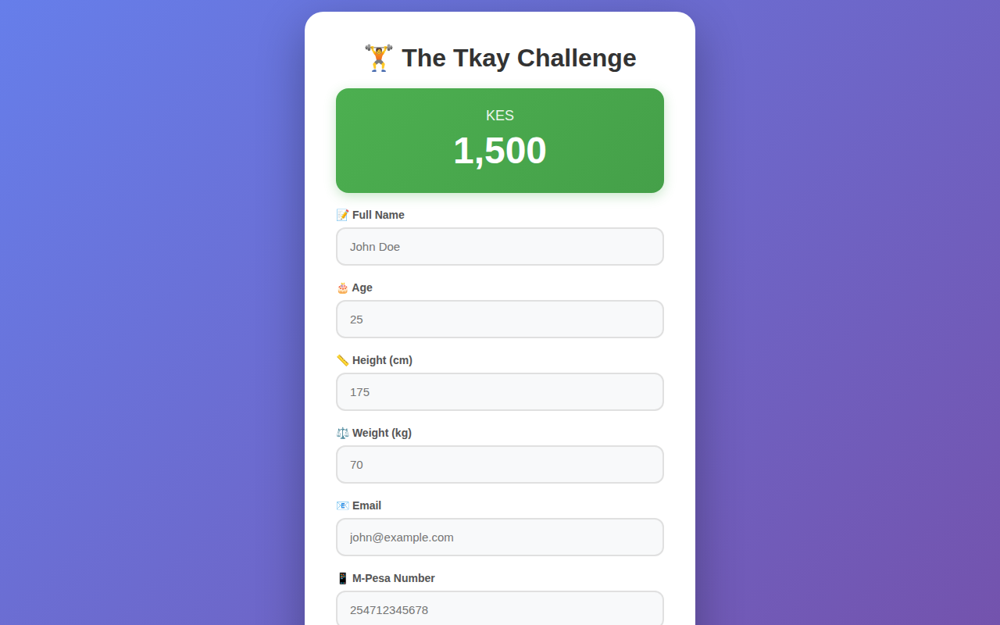
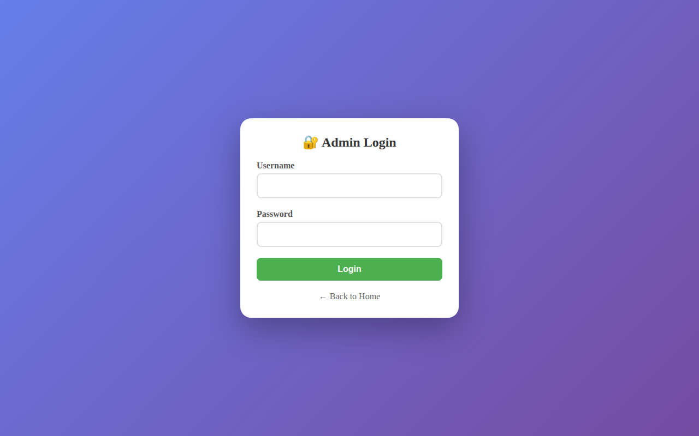
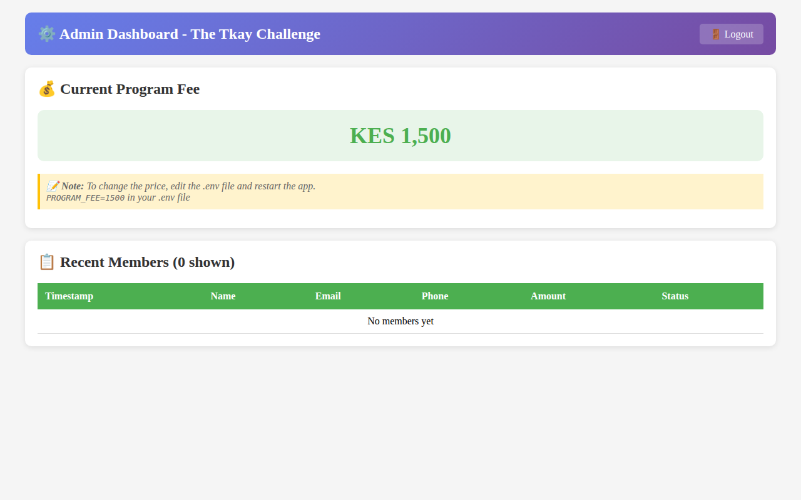

# 🏋️ The Tkay Challenge Website

Welcome to the official repository for **The Tkay Challenge** website! This is a robust, mobile-responsive Flask web application designed for program registrations, featuring integrated payment processing and automated data logging.

## 🚀 Key Features

*   **📱 Responsive Design**: A modern, mobile-first user interface for easy registration on any device.
*   **💳 Seamless Payments**: Integrated with **IntaSend** for secure M-Pesa STK Push payments.
*   **📊 Automated Logging**: Automatically saves member details and payment status to **Google Sheets**.
*   **🔐 Admin Dashboard**: A protected area for administrators to:
    *   Monitor recent registrations in real-time.
    *   View current program fees.
    *   Manage member logs.
*   **🛡️ Security**: Features like disabling F12/right-click to protect the UI and session-based admin authentication.

## 📸 Screenshots

### Homepage


### Admin Login


### Admin Dashboard


## 🛠️ Technology Stack

*   **Backend**: Python (Flask)
*   **Payments**: IntaSend SDK
*   **Database**: Google Sheets API (via `gspread`)
*   **Environment**: `python-dotenv` for secure configuration

## 📋 Prerequisites

Before you begin, ensure you have the following:
*   Python 3.8 or higher.
*   An IntaSend account (Publishable Key and Secret Token).
*   A Google Cloud Project with the Google Sheets API enabled and a service account JSON key.

## ⚙️ Setup & Installation

### 1. Clone the Repository
```bash
git clone https://github.com/DrochaS/snapd.git
cd snapd
```

### 2. Install Dependencies
```bash
pip install -r requirements.txt
```

### 3. Environment Configuration
Create a `.env` file in the root directory by copying `.env.example` and filling in your credentials:

```bash
cp .env.example .env
```

### 4. Google Sheets Setup
1.  Place your Google Service Account key as `gym-credentials.json` in the root directory of the project.
2.  Create a Google Sheet and share it with the email address found in your service account JSON.
3.  The app will automatically create a sheet named "The Tkay Challenge" (or whatever `PROGRAM_NAME` is set to) if it doesn't exist.

## 🏃 Running the App

Start the development server:
```bash
python app.py
```
The application will be available at `http://127.0.0.1:5000`.

## 📄 License
[Include license info here if applicable]
